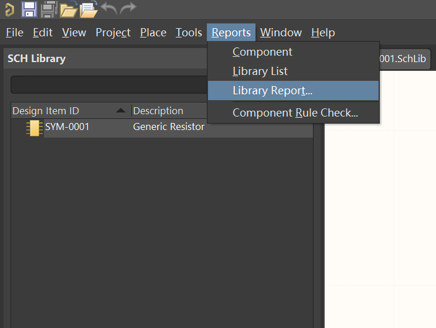
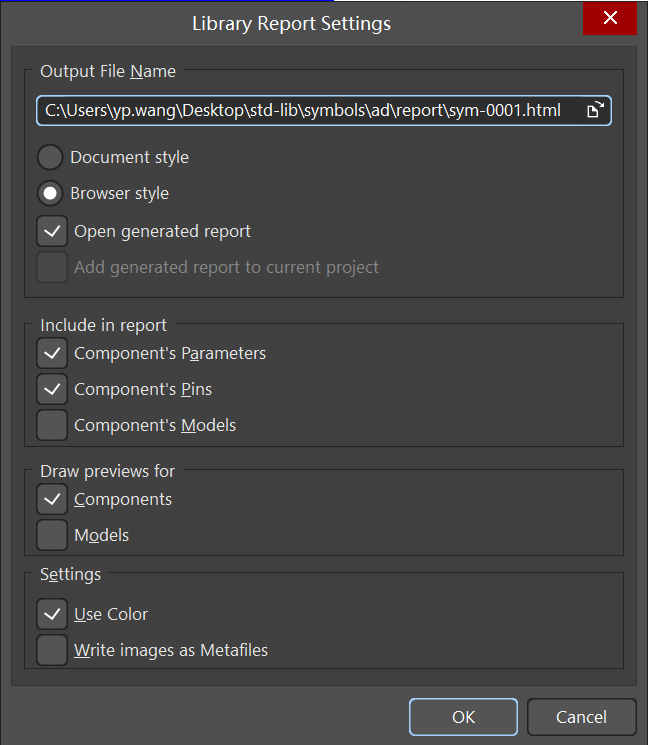

# 贡献指南

仓库采用GitHub[`fork + pull request`](https://aaronflower.github.io/essays/github-fork-pull-workflow.html)的方式进行协作，如果你想为仓库贡献内容，可以按照以下步骤进行。

## 新建元器件

### 原理图符号

协作者应首先查看仓库`Issues`和`Pull requests`中是否有自己需求的原理图符号正在工作中，如果有，可与其他协作者协作完成。

如果确定需要新建原理图符号，则应该提交新的`issue`，然后说明自己正在做这个工作。然后`fork`仓库到自己账号，`clone`到本地后，新建`new/ad/sym-xxxx`分支，并推送到自己的远端仓库，并创建`pull request`草案，以便其他协作者看到这个符号库文件已经被创建，避免合并到主分支时出现冲突。

原理图符号文件以`sym-`开头，后面为4位序列号，例如`sym-0001.SchLib`。每个原理图符号文件中只能包含一个同名原理图符号，并将`sym-`改为大写，例如`sym-0001.SchLib`中的原理图符号为`SYM-0001`。

创建好新的原理图符号，检查无误后，创建原理图符号简略图，推送到远端仓库，然后提交`pull request`，等待审核。

### 绘制原则

1. 采用英制单位，格点优先采用100mil及其整数倍。
2. 使用原理图符号模板文件`templates/ad/symbol-template.SchLib`新建原理图符号文件。
3. 优先使用双列引脚布局。
4. 四边引脚布局时，引脚数不超过48个。
5. 引脚数超过60个时，考虑拆分为多个部分。
6. 引脚长度不小于100mil，不大于400mil，与符号主题大小相适应。
7. 引脚间距不小于50mil，优先使用100mil，且引脚必须与格点对齐。
8. 原理图符号引脚布局不必与器件引脚布局一致，但引脚序号必须与器件引脚序号一致，优先考虑常用电路原理图绘制习惯，优先考虑引脚功能分组。
9. 低电平有效引脚优先使用`/`表示，例如`/RESET`;也可以使用AD的"\"语法表示；不过尽量与器件数据表中保持一致。
10. 字体统一为`Consolas`，大小为`10`号。

### 默认字体设置

在`Altium Designer`中，可以通过`Preferences`设置默认字体。设置方法如下：

将原理图符号库文件中`Comment`, `Designator`, `Pin`的字体设置为`Consolas`，大小设置为`10`号。这样可以保持所有原理图符号的字体一致。

`Consolas`是一种等宽字体，在`Win10`以上默认安装，适合原理图符号的绘制。`10`号字体大小在A4纸上的显示效果也比较好。

### 原理图符号简略图和报告

绘制好原理图符号并检查无误后，使用`Altium Designer`的`Report`功能，生成原理图符号简略图和报告。报告中包含原理图符号的引脚定义，引脚功能，引脚电气特性等信息。将简略图和报告推送到远端仓库，然后提交`pull request`，等待审核。

方法和设置如下：

> 注意：
> 
> 生成的报告保存在`report`文件夹中，其中缩略图文件名为随机字符，需要修改文件名为对应符号编号，如"SYM-0001"，并移动到`preview`文件夹中，然后再提交，推送到远端仓库。
>
> 一个原理图符号库文件中只有一个原理图符号时，生成的报告文件中'sym-xxxx_2.html'没有内容，可以删除这个文件。
>
> 对于拆分为多个部分的原理图符号，缩略图需要各个生成，全部填入多维表格。也可以使用[在线拼接工具](https://uutool.cn/photo-collage/)，将多个缩略图拼接在一起上传。

一个符号，一次提交，一次PR，这样可以使主分支历史记录更加清晰。

### PCB封装图形

同理，如果要新建封装库，应该在`clone`仓库后，新建`new/ad/fp-xxxx`分支，并推送到远端仓库，以便其他协作者看到这个封装库文件已经被创建，避免合并到主分支时出现冲突。

PCB封装文件以`fp-`开头，后面为4位序列号，例如`fp-0001.PcbLib`。每个PCB封装文件中只能包含一个同名PCB封装，并将`fp-`改为大写，例如`fp-0001.PcbLib`中的PCB封装为`FP-0001`。对于封装变体，可以在文件名中加尾缀来表示，3d模型变体使用数字尾缀，例如`fp-0001-1.PcbLib`；贴装密度变体用字母`L`、`M`表示，常规密度`N`可以省略，例如`fp-0001M.PcbLib`，表示低密度；封装方向变体用`Q1`、`Q2`、`Q3`、`Q4`表示，例如`fp-0001Q1.PcbLib`，表示封装方向为`Q1`，符合IPC-7351C标准方向的封装可以省略。

创建好新的PCB封装，检查无误后，创建PCB封装简略图，推送到远端仓库，然后提交`pull request`，等待审核。

### 3D模型

3D模型文件以`stp-`开头，后面与对应PCB封装序列号相同。例如`stp-0001.step`。

> 注意：PCB封装文件和3D模型文件通常大于100kB，要使用`git lfs`追踪这些文件。点击查看`git lfs`[安装方法](https://docs.github.com/zh/repositories/working-with-files/managing-large-files/installing-git-large-file-storage)。
